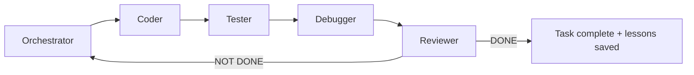
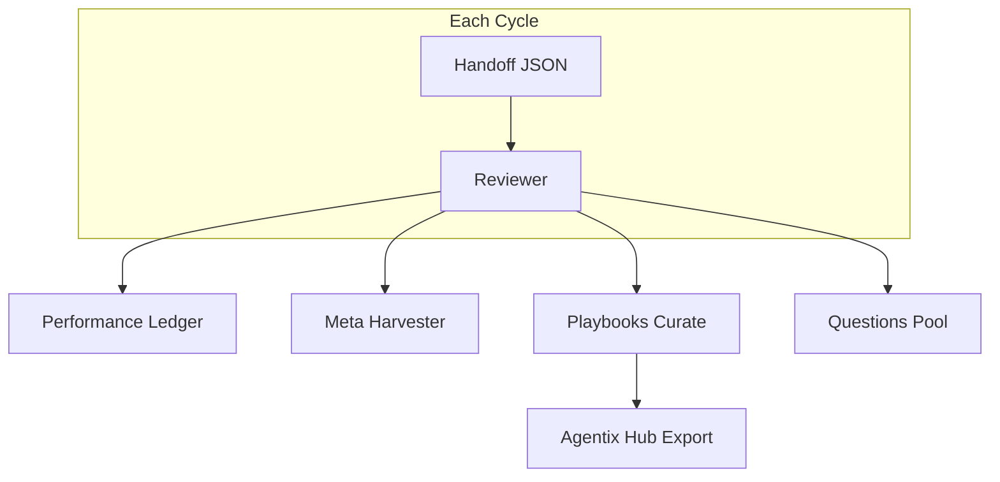

# Agentix

[](CHANGELOG.md)
[](LICENSE)
[](docs/getting-started.md)
[](docs/cross-platform.md)
[](docs/README.md)
[](https://github.com/unhexx/agentic_loop_template)

**Production-grade, self-improving multi-role agentic development loop.**

Plan → implement → test → debug → review in a closed loop until the Reviewer confirms **DONE**. Every cycle compounds knowledge via memory, playbooks, and meta-optimization.

Maintained by [exception.expert](https://exception.expert).

---

## Table of Contents

- [Quick Start](#quick-start)
- [How It Works](#how-it-works)
- [Example: One Full Cycle](#example-one-full-cycle)
- [CLI Tools](#cli-tools)
- [Features](#features)
- [Documentation](#documentation)
- [Project Structure](#project-structure)
- [Measured Results](#measured-results)
- [Adaptation](#adaptation-for-your-project)
- [Contributing](#contributing)

---

## Quick Start

### Prerequisites

| Requirement | Version |
|-------------|---------|
| Python | 3.10+ |
| Git | any recent |
| Agent frontend | [Cursor](docs/multi-frontend.md), Claude Code, Blackbox, or compatible |

### 1. Bootstrap (choose your platform)

<details>
<summary><strong>Windows (PowerShell)</strong></summary>

```powershell
git clone https://github.com/unhexx/agentic_loop_template.git
cd agentic_loop_template
.\Agent-Init.ps1
```

</details>

<details>
<summary><strong>Linux / macOS (bash)</strong></summary>

```bash
git clone https://github.com/unhexx/agentic_loop_template.git
cd agentic_loop_template
bash Agent-Init.sh --wizard    # interactive setup
source .venv/bin/activate
```

Cold-start every cycle (do **not** load multi-MB `.agent` dumps):

```bash
python -m memory state snapshot --window 3
python -m memory query --top 5 --category "Common Failure Patterns"
python tools/select.py --intent bootstrap
```

See [`docs/TOP10_IMPROVEMENTS.md`](docs/TOP10_IMPROVEMENTS.md) (harness efficiency) and [`VERSION`](VERSION).


</details>

### 2. Verify with one-command demo

```bash
bash scripts/demo-loop.sh
```

Expected output (abbreviated):

```
=== Agentix Demo Loop ===
Initializing Agentix env (cross-platform)...
--- Seeding playbooks ---
Seeded 5 playbooks
--- Plan check ---
PLAN + SPEC: OK
--- Hub export ---
{"exported": ".agent/HUB_INDEX.json", "item_count": 5}
=== Demo complete. Start agent with prompts/short_orchestrator_prompt.md ===
```

### 3. Launch the agent loop

1. Open your project in **Cursor**, **Claude Code**, or **Blackbox**.
2. Paste the contents of [`prompts/short_orchestrator_prompt.md`](prompts/short_orchestrator_prompt.md) as the **first message**.
3. The agent starts as **Orchestrator**, reads `.agent/PLAN.md`, and begins the cycle.

> **New consumer project?** Copy [`examples/consumer-starter/`](examples/consumer-starter/) into your repo first.

---

## How It Works

### Sprint loop (roles)



Each role runs an inner loop: **PLAN → ACT (≤3 tool calls) → REFLECT → handoff JSON**.

### State transfer

All context moves through strict JSON handoffs ([`HANDOFF_SCHEMA.md`](HANDOFF_SCHEMA.md)). No prose after the closing `}`.

### Self-improvement stack



---

## Example: One Full Cycle

Below is a realistic mini-cycle: Orchestrator plans, Coder implements, Reviewer closes.

### Step 1 — Orchestrator plans

The agent reads the plan and picks the next INVEST task:

```bash
# Orchestrator consults playbooks before planning
python -m memory.playbooks select --query "git sync planning" --scopes "global,tool:git" --k 3
```

**Handoff excerpt** (Orchestrator → Coder):

```json
{
  "handoff_to": "Coder",
  "role": "Orchestrator",
  "current_phase": "planning",
  "summary": "Выбрал задачу P3-HUB-01: добавить export в playbooks. Git sync verified.",
  "next_input_files": ["TASK_SPECIFICATION.md", ".agent/TODO.md"],
  "git_sync_status": { "verified": true, "feature_pushed": true },
  "confidence": 0.92,
  "status": "IN_PROGRESS"
}
```

### Step 2 — Coder implements

```bash
# Coder runs tests after changes
source .venv/bin/activate
python -m memory.playbooks export --format hub
```

**Commit message** (natural Russian, human voice):

```
Добавил export hub index в playbooks и тест на валидность JSON
```

### Step 3 — Tester → Debugger → Reviewer

| Role | Action |
|------|--------|
| **Tester** | Runs `python -m memory.test_playbooks_hub`, reports coverage |
| **Debugger** | Fixes failures if any |
| **Reviewer** | Compares result to spec, updates ledger, harvests meta |

**Reviewer closes the cycle:**

```json
{
  "handoff_to": "None",
  "role": "Reviewer",
  "status": "DONE",
  "performance": {
    "cycle": 42,
    "elapsed_minutes": 1.6,
    "confidence": 0.94,
    "tests_failed": 0,
    "meta_applied": 1
  },
  "memory_updated": true,
  "patterns_merged": 2
}
```

### What gets updated automatically

| Artifact | Updated by |
|----------|------------|
| `.agent/PERFORMANCE_LEDGER.md` | Reviewer / meta_harvester |
| `.agent/PLAYBOOKS.json` | playbooks curate |
| `.agent/META_PROPOSALS.md` | meta_harvester |
| `PROJECT_CONTEXT.md` | Orchestrator + Reviewer |

---

## CLI Tools

| Command | Purpose |
|---------|---------|
| `bash scripts/demo-loop.sh` | One-command smoke demo |
| `python -m memory.supervisor run --adapter mock --max-cycles 1 --no-pr` | Unattended role loop (mock CI path); adapters: mock/grok/cursor/blackbox |
| `python -m memory.supervisor run-parallel --stream name:paths …` | Multi-stream hub (3.5.1+); owned_paths gate + single PR |
| `scripts/agentix-supervisor run ...` | Bash shim for the same supervisor CLI |
| `python -m memory.playbooks select --query "..."` | Inject relevant knowledge bullets |
| `python -m memory.playbooks export --format hub` | Export Hub discovery index |
| `python -m memory.performance_ledger` | View cycle metrics |
| `python -m memory.meta_harvester harvest --handoff ...` | Capture golden trajectories |
| `python -m memory.audit_log list` | Enterprise audit trail |
| `python -m memory.resume --json` | Resume after session crash |
| `python -m memory.eval_harness --recent 5` | Score recent trajectories |

Supervisor drives O→C→T→R turns, validates handoffs, and on `PR_READY` opens a PR via `gh pr create` (never merges to `main`). Use `--no-pr` for local/CI dry runs. Config lives under `supervisor` in `.agent/project_config.json` (see `project_config.example.json`).

### Parallel streams (3.5.1)

Run multiple path-disjoint streams under one supervisor hub (serial in 3.5.1; concurrent fan-out later). After worktrees exist (or let the hub provision them):

```bash
export PYTHONPATH=.
python -m memory.supervisor run-parallel \
  --stream harness:memory/,tools/ \
  --stream docs:docs/ \
  --adapter mock \
  --no-pr
```

Each stream is gated to `owned_paths`; the hub merges serially into a single PR. State: `.agent/streams_state.json`. See [`PARALLEL_PROTOCOL.md`](PARALLEL_PROTOCOL.md).

Full memory layer docs: [`memory/README.md`](memory/README.md).

---

## Features

| Category | Capability |
|----------|------------|
| **Loop discipline** | 5 roles, JSON handoffs, INVEST tasks, git §11 sync |
| **Self-improvement** | Playbooks (ACE scoring), meta-harvester, performance ledger |
| **Cross-platform** | `Agent-Init.ps1` + `Agent-Init.sh`, platform-adaptive prompts |
| **Multi-frontend** | Cursor, Claude Code, Blackbox adapters |
| **Productization** | `docs/` site, consumer-starter, Agentix Hub |
| **Enterprise** | Audit log, policy samples, GitHub Actions trigger |
| **DX** | Onboarding wizard, stack templates, VS Code extension recommendations |
| **MCP** | Extensible tool registry for shell, GUI, vision, fleet, integrations |

---

## Documentation

| Guide | Description |
|-------|-------------|
| [docs/getting-started.md](docs/getting-started.md) | 5-minute bootstrap |
| [docs/architecture.md](docs/architecture.md) | Roles, handoffs, memory |
| [docs/multi-frontend.md](docs/multi-frontend.md) | Cursor / Claude / Blackbox |
| [docs/metrics-roi.md](docs/metrics-roi.md) | Proof from 50+ dogfood cycles |
| [docs/hub/README.md](docs/hub/README.md) | Playbook marketplace |
| [docs/enterprise-governance.md](docs/enterprise-governance.md) | Policy + audit |
| [docs/case-study.md](docs/case-study.md) | Dogfood case study |
| [AGENT_ROLES.md](AGENT_ROLES.md) | Per-role instructions |
| [HANDOFF_SCHEMA.md](HANDOFF_SCHEMA.md) | JSON contract |
| [DEVELOPMENT_STANDARDS.md](DEVELOPMENT_STANDARDS.md) | Process constitution |

Full index: [**docs/README.md**](docs/README.md)

---

## Project Structure

```
agentic_loop_template/
├── README.md                 # You are here
├── docs/                     # Documentation site
├── examples/
│   ├── consumer-starter/     # Adoption template
│   ├── stack-templates/      # Python API, static docs
│   └── case-study/           # Sanitized trajectory
├── memory/                   # Ledger, playbooks, meta, audit, resume
├── prompts/                  # Short role prompts (start here)
├── scripts/demo-loop.sh      # One-command demo
├── .agent/                   # PLAN, TODO, ledger, playbooks, hub index
├── Agent-Init.ps1 / .sh      # Bootstrap scripts
├── SYSTEM_PROMPT.md          # Master prompt (fill {{placeholders}})
├── AGENT_ROLES.md            # Role blocks
└── HANDOFF_SCHEMA.md         # Handoff contract
```

---

## Measured Results

Dogfooded on this repo over **50+ cycles** (Business Efficiency Initiative, v3.4.0):

| Metric | Value |
|--------|-------|
| Avg cycle elapsed (recent) | ~1.6 min |
| Avg confidence | 0.94 |
| Tests failed (recent band) | 0 |
| Meta/playbook improvements | Applied each qualifying cycle |

Source: [`.agent/PERFORMANCE_LEDGER.md`](.agent/PERFORMANCE_LEDGER.md) · [docs/metrics-roi.md](docs/metrics-roi.md)

---

## Adaptation for Your Project

1. Copy this template into your repo (or use [`examples/consumer-starter/`](examples/consumer-starter/)).
2. Fill `{{placeholders}}` in [`SYSTEM_PROMPT.md`](SYSTEM_PROMPT.md).
3. Create [`TASK_SPECIFICATION.md`](TASK_SPECIFICATION.md) with testable requirements.
4. Run bootstrap (`Agent-Init.ps1` or `Agent-Init.sh --wizard`).
5. Add `agentic_loop_template/` and cycle artifacts to `.gitignore` in consumer repos.
6. Customize [`TOOLS_REGISTRY.md`](TOOLS_REGISTRY.md) for your MCP skills.

---

## Contributing

- Follow [`DEVELOPMENT_STANDARDS.md`](DEVELOPMENT_STANDARDS.md) (INVEST tasks, git §11, UTF-8).
- Commit messages: natural Russian, human senior-dev voice.
- Changes must be backward-compatible or documented in [`CHANGELOG.md`](CHANGELOG.md).
- [Open an issue](https://github.com/unhexx/agentic_loop_template/issues) or PR on GitHub.

---

## License

[MIT](LICENSE) · **Agentix 3.4.0** · Maintained by **exception.expert**