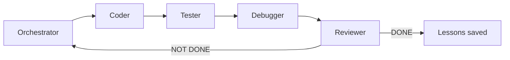
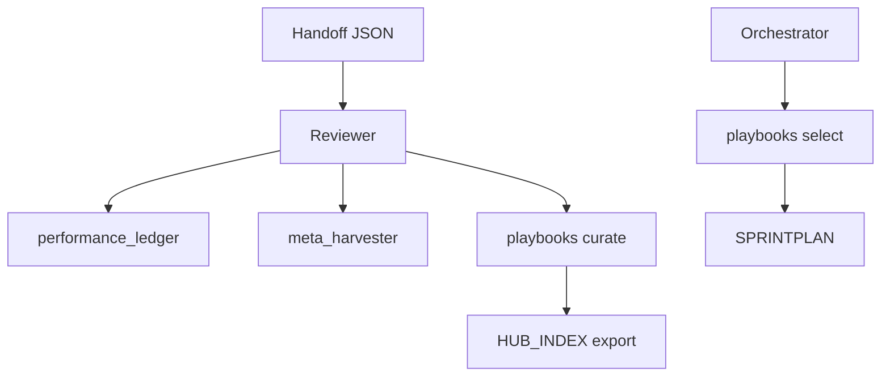

# Architecture

[](../README.md)
[](../HANDOFF_SCHEMA.md)

How the Agentix loop is structured: roles, state transfer, and self-improvement layers.

---

## Loop Overview



Each role: **PLAN → ACT (≤3 tool calls) → REFLECT → handoff JSON**.

---

## Core Components

| Layer | Location | Purpose |
|-------|----------|---------|
| Roles & prompts | `AGENT_ROLES.md`, `prompts/` | Per-role discipline |
| Handoffs | `HANDOFF_SCHEMA.md` | State transfer contract |
| Memory | `memory/` | questions_collector, meta_harvester, playbooks, ledger |
| Planning | `.agent/PLAN.md`, `.agent/TODO.md` | Iteration continuity |
| Playbooks | `.agent/PLAYBOOKS.json` | Knowledge bullets (ACE scoring) |
| Hub | `.agent/HUB_INDEX.json` | Exportable discovery index |
| Audit | `memory/audit_log.py` | Enterprise trail (P5) |
| Resume | `memory/resume.py` | Crash recovery (P7) |

---

## Handoff Example

Every role ends with exactly one JSON object:

```json
{
  "handoff_to": "Coder",
  "role": "Orchestrator",
  "summary": "Planned next INVEST task. Git sync verified.",
  "next_input_files": [".agent/TODO.md"],
  "git_sync_status": { "verified": true },
  "confidence": 0.9,
  "status": "IN_PROGRESS"
}
```

Full schema: [HANDOFF_SCHEMA.md](../HANDOFF_SCHEMA.md).

---

## Self-Improvement Stack

| Module | CLI | When |
|--------|-----|------|
| Performance Ledger | `python -m memory.performance_ledger` | Reviewer on DONE |
| Meta Harvester | `python -m memory.meta_harvester harvest` | High-quality cycles |
| Playbooks | `python -m memory.playbooks select/curate` | PLAN / REFLECT |
| Questions Pool | `python -m memory.questions_collector` | Non-blocking approvals |
| Eval Harness | `python -m memory.eval_harness` | Trajectory scoring |

---

## Data Flow



---

## Related

- [Metrics & ROI](metrics-roi.md) — measured cycle gains
- [Hub](hub/README.md) — playbook marketplace
- [memory/README.md](../memory/README.md) — memory layer API