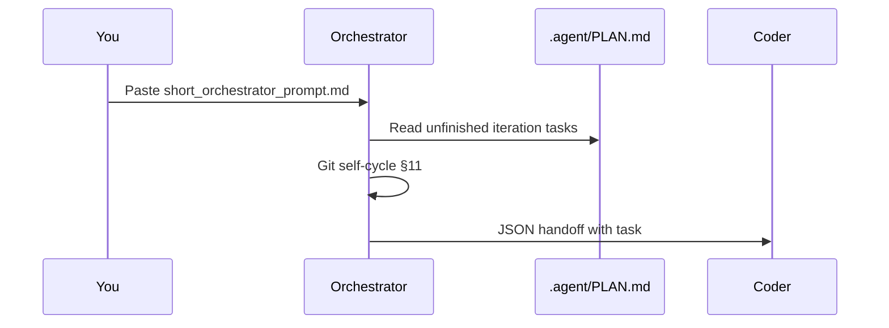

# Getting Started

[](../README.md)

Get a full agentic development loop running in under five minutes.

---

## Prerequisites

| Tool | Requirement |
|------|-------------|
| Python | 3.10+ |
| Git | recent version |
| Agent UI | Cursor, Claude Code, Blackbox, or compatible |

---

## Step 1 — Clone and bootstrap

### Windows

```powershell
git clone https://github.com/unhexx/agentic_loop_template.git
cd agentic_loop_template
.\Agent-Init.ps1
```

### Linux / macOS

```bash
git clone https://github.com/unhexx/agentic_loop_template.git
cd agentic_loop_template
bash Agent-Init.sh --wizard
source .venv/bin/activate
```

The wizard creates `TASK_SPECIFICATION.md` and `PROJECT_CONTEXT.md` from templates if missing.

---

## Step 2 — Smoke test

```bash
bash scripts/demo-loop.sh
```

You should see:

```
=== Agentix Demo Loop ===
PLAN + SPEC: OK
=== Demo complete. Start agent with prompts/short_orchestrator_prompt.md ===
```

---

## Step 3 — Start the loop

Copy [`prompts/short_orchestrator_prompt.md`](../prompts/short_orchestrator_prompt.md) into your agent as the **first message**.



---

## Example session

### Orchestrator output (conceptual)

```
Reading .agent/PLAN.md + .agent/TODO.md ...
Git sync verified across clones.
Selected task: P3-HUB-01 — Hub export CLI.
Handing off to Coder.
```

### Handoff JSON (end of Orchestrator turn)

```json
{
  "handoff_to": "Coder",
  "role": "Orchestrator",
  "summary": "Запланировал реализацию Hub export. Git sync OK.",
  "next_input_files": [".agent/TODO.md", "memory/playbooks.py"],
  "confidence": 0.9,
  "status": "IN_PROGRESS"
}
```

### Coder output (conceptual)

```
Implementing playbooks export ...
Running: python -m memory.playbooks export --format hub
Commit: Добавил export hub index в playbooks
Handing off to Tester.
```

---

## First cycle checklist

| Step | Role | Action |
|------|------|--------|
| 1 | Orchestrator | Read `TASK_SPECIFICATION.md`, `.agent/PLAN.md`, git §11 sync |
| 2 | Orchestrator | Plan INVEST task, hand off to Coder |
| 3 | Coder | Implement, commit (Russian message), hand off to Tester |
| 4 | Tester | Run tests, report coverage, hand off to Debugger or Reviewer |
| 5 | Debugger | Fix root causes if tests fail |
| 6 | Reviewer | Spec check, ledger update, `DONE` or loop back |

---

## Consumer projects

1. Copy [`examples/consumer-starter/`](../examples/consumer-starter/) into your repo.
2. Add `agentic_loop_template/` to `.gitignore` (see `.gitignore.agentic`).
3. Fill `SYSTEM_PROMPT.md` placeholders.
4. Run bootstrap on your platform.

---

## Next steps

| Topic | Link |
|-------|------|
| Cursor / Claude setup | [multi-frontend.md](multi-frontend.md) |
| Platform differences | [cross-platform.md](cross-platform.md) |
| Full architecture | [architecture.md](architecture.md) |
| CLI reference | [../README.md#cli-tools](../README.md#cli-tools) |